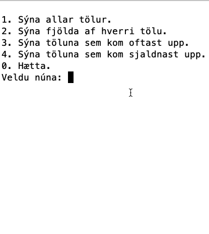

# FORR3CG - Skilaverkefni 1 (5%)

- **Verkefnið er einstaklingsverkefni.** Ef tveir eða fleiri nemendur skila sömu lausnunum er gefið 0 (núll) fyrir þær lausnir.
- **Ef kóði er tekinn af netinu** (eða öðrum álíka stöðum) skal taka það fram, benda á hvaðan hann kemur og skrifa skýringar (e. comment) við hverja línu kóðans. Almennt eru ekki gefin stig fyrir kóða sem tekinn er af netinu.
- **Notið** `do-while` og `switch-case` við lausn valmyndarinnar.

## Verkefnalýsing

Skrifaðu forrit sem tekur 100 (eitthundrað) tölur á bilinu 0 (núll) til og með 9 (níu) af handahófi (e. random) og setur þær í fylki. Hafðu svo annað fylki sem heldur utan um hversu mikið er af hverri tölu, þ.e. hversu mörg núll, hversu margir einn o.s.frv.

Forritið á svo að birta valmynd þar sem notandinn getur valið um að gera eftirfarandi:

- Sjá allar 100 tölurnar, skrifist út í 10 línum, 10 tölur í línu.
- Sjá fjölda af hverjum tölustaf.
- Sjá töluna sem kom oftast upp. __*__
- Sjá töluna sem kom sjaldnast upp. __*__
- Hætta keyrslu forritsins.

__*__ ekki þarf að bregðast sérstaklega við ef tvær eða fleirri tölur koma jafn oft eða sjaldan upp. Nóg er að birta eina.

Forritið þarf svo að bregðast við með viðeigandi hætti ef notandi velur eitthvað annað en það sem er í boði í valmyndinni.

### Dæmi um virkni



## Skil á verkefninu

Skilið verkefninu á Innu. Skilin ættu að vera ein .cpp skrá.

## Bjargir

### Slembitölur (e. random)

Til að nota slembitölur í C++ þarf að nota söfnin `cstdlib` og `ctime`. Fallið `srand` er svo notað til að "seed-a" slembifallið og fallið `rand` notað til að fá slembitölu. Dæmi:

```c++
#include <iostream>
#include <cstdlib>
#include <ctime>

int main() {
    std::srand(std::time(0));
    std::cout << std::rand() % 10 << std::endl;
    // skrifar út eina tölu á bilinu 0 til og með 9
    return 0;
}
```

### Frumstilla stök í fylki

Til að frumstilla öll stök í fylki með sama gildinu er nóg að gera eftirfarandi:

```c++
int fylki[5] = {0}; // býr til 5 staka fylki og setur öll stökin sem núll
```
